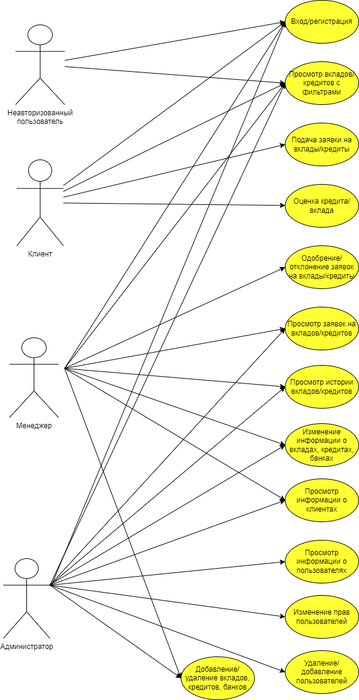
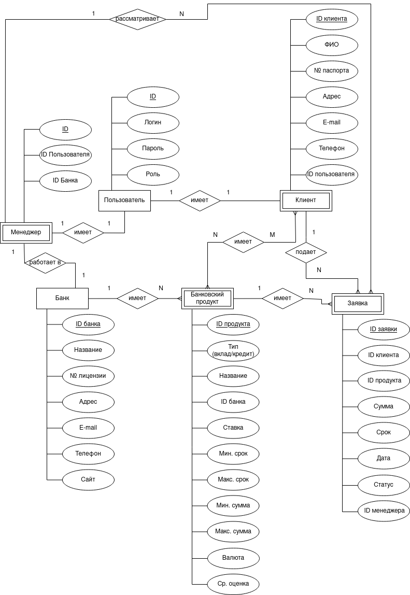
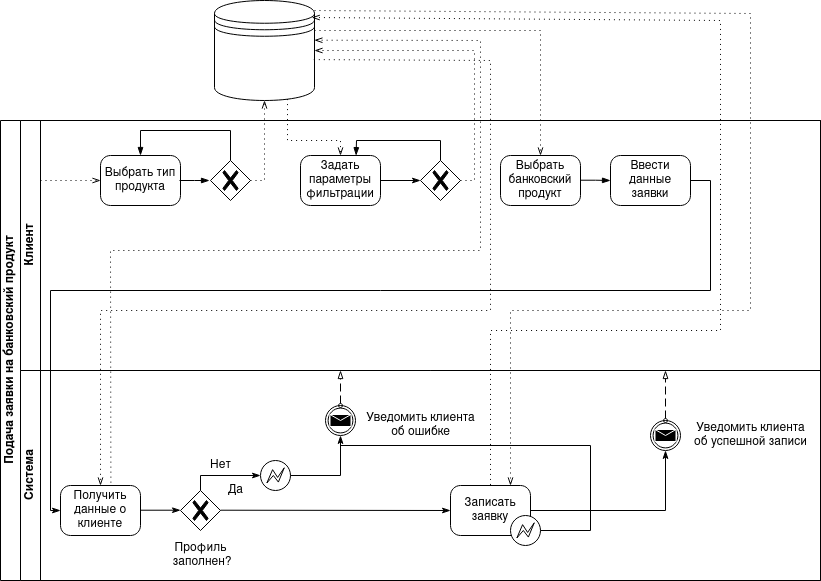
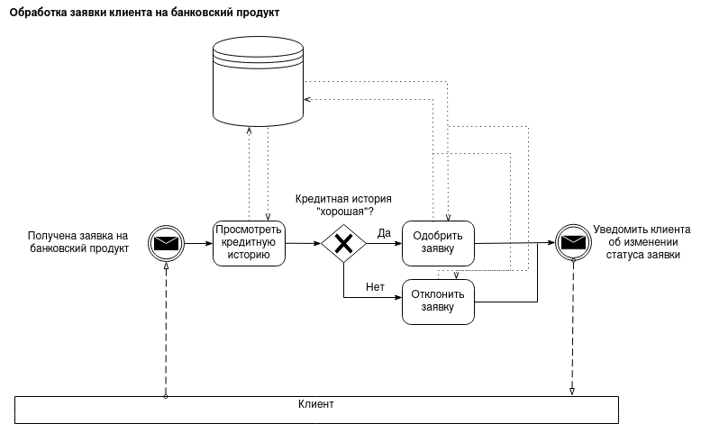

# Агрегатор банковских вкладов и кредитов

## Краткое описание идеи проекта

Необходимо реализовать БД, интерфейс для доступа к данным,
а также наполнить базу данных необходимыми данными для работы приложения.
Данный проект предоставляет возможность поиска банковских вкладов и кредитов с фильтрацией,
подачи заявок на банковские вклады и кредиты и их одобрения менеджером банка, 
оценивания банковского вклада или кредита.
Также производится сбор статистики по средним оценкам банковских вкладов и кредитов.

## Краткое описание предметной области
Предметной областью является кредитование и размещение средств физических лиц. 
Верное ведение учета выданных кредитов и размещенных вкладов, средняя оценка 
банковских кредитов и вкладов от клиентов играют значительную роль в данной области. Клиенты банка подают заявки на вклады/кредиты, 
менеджер банка вправе одобрить или отклонить данные заявки.

## Краткий анализ аналогичных решений

| Название     | Desktop-приложение | Фильтрация (число фильтров)  |    Рейтинг вкладов/кредитов          | Обязательная регистрация |
|:-------------|:----------|:----|:--------------|:-----------|
| banki.ru     |  Нет  |  Да (4)  | Да (есть только общий рейтинг продуктов банка)  | Нет |
| finuslugi.ru | Нет |  Да (3)  | Нет   | Нет |
| sravni.ru    | Нет  | Да (8)  |  Да (есть только общий рейтинг продуктов банка) | Нет |

Ни одно из рассмотренных аналогичных решений не дает возможности посмотреть рейтинг (оценку) конкретного банковского продукта, только общий рейтинг банка. Также подача заявок на вклады/кредиты производится только с помощью переадресации на сайт банка. Все из рассмотренных решений имеют тип интерфейса - Web MPA и Mobile.

## Краткое обоснование целесообразности и актуальности проекта
Данный проект позволяет найти подходящий кредит или вклад клиентам банков благодаря 
возможности поиска с фильтрацией и рейтинга кредитов и вкладов,
основанного на оценках пользователей приложения. 
Это особенно актуально в период частых изменений ключевой ставки ЦБ, 
которая напрямую влияет на процентные ставки по вкладам и кредитам.
Кредитование и размещение вкладов одни из основных направлений деятельности банков.

## Use-case диаграмма
В данном проекте существуют следующие типы пользователей: неавторизованный пользователь, клиент, менеджер и администратор (права как у разработчика).

## ER-диаграмма сущностей

Примечание: пользователь не может быть одновременно клиентом и менеджером.

## Пользовательские сценарии

Сценарий выбора банковского продукта:

0. Возможность поиска банковских продуктов есть даже у неавторизованных пользователей.
1. На главном экране приложения необходимо выбрать тип банковского продукта - кредит или вклад.
2. На главном экране появится список из 10 самых лучших 
по оценкам пользователей банковских продуктов выбранного типа.
3. Чтобы отфильтровать банковские продукты, необходимо задать желаемые параметры
(название банка, сумма, процентная ставка, срок, валюта) и применить их.
4. Чтобы отсортировать банковские продукты по какому-либо параметру, необходимо выбрать 
параметр сортировки (название, сумма, срок, процентная ставка)
и применить.

Сценарий регистрации:
1. В меню главного экрана приложения перейти на страницу регистрации.
2. В открывшемся окне ввести придуманный логин и пароль для учетной записи 
(пароль вводится 2 раза для подтвержения).
3. Подтвердить регистрацию.
4. Если введенные пароли отличаются выведется сообщение об ошибке 
с соответствующим сообщением.
4.1 Закрыть окно с ошибкой.
4.2 Повторить попытку регистрации по пунктам 2-3 или выйти
из окна регистрации.
5. После успешной регистрации можно заполнить профиль, перейдя в профиль.
6. Ввести необходимые данные (ФИО, № паспорта, адрес проживания, телефон и e-mail).
7. Сохранить изменения.

Сценарий авторизации:
1. В меню главного экрана приложения перейти на страницу входа в профиль.
2. В открывшемся окне ввести логин и пароль от учетной записи.
3. Подтвердить вход.
4. Если логин или пароль введен неверно, приложение выдаст сообщение об ошибке 
с соответствующим сообщением.
4.1 Закрыть окно с ошибкой.
4.2 Повторить попытку входа по пунктам 2-3 или выйти
из окна входа.

Сценарий выдачи прав менеджера администратором:
1. Авторизоваться.
2. Перейти на страницу со списком пользователей приложения.
3. Выбрать пользователя из списка.
4. Назначить пользователю роль менеджера.
5. Назначить менеджеру его банк.
6. Сохранить изменения.

Сценарий подачи заявки на банковский продукт:

0. Зарегистрироваться, если нет учетной записи.
1. Авторизоваться.
2. Выбрать желаемый банковский продукт из списка 
предложенных по заданным фильтрам.
3. В открывшемся окне ввести желаемую сумму и срок.
4. Отправить заявку.
5. Если сумма или срок выбран некорректно, приложение выдаст сообщение об ошибке 
с соответствующим сообщением. Также если профиль пользователя не заполнен, 
приложение выдаст сообщение об ошибке с соответствующим сообщением.
5.1 Закрыть окно с ошибкой. 
5.2 Скорректировать введенные данные и повторить попытку, если была ошибка ввода,
или выйти из окна подачи заявки, заполнить профиль и повторить попытку
подачи заявки по пунктам 2-4, если была ошибка, связанная с незаполненным профилем.
6. Отслеживать статус заявки (открыта, отклонена, одобрена) в личном кабинете 
на странице <<Мои заявки>>.

Сценарий оценки банковского продукта (при наличии заявок):
1. Авторизоваться.
2. Перейти в профиль.
3. Перейти на страницу <<Мои заявки>>.
4. Выбрать банковский продукт со статусом <<одобрен>> или <<закрыт>>.
5. Поставить оценку выбранному банковскому продукту.

Сценарий обработки заявки на банковский продукт (для менеджера):
1. Авторизоваться.
2. Открыть список заявок.
3. Выбрать заявку.
4. Просмотреть кредитную историю клиента, подавшего заявку.
5. Одобрить или отклонить поступившую заявку.

## Формализация бизнес-правил

