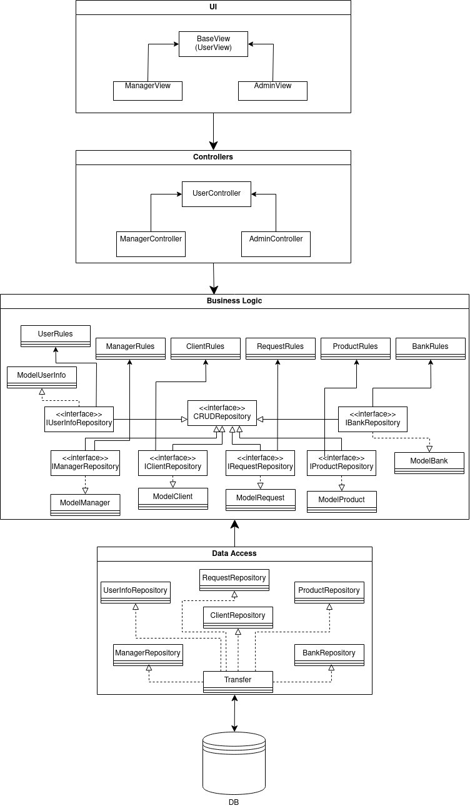
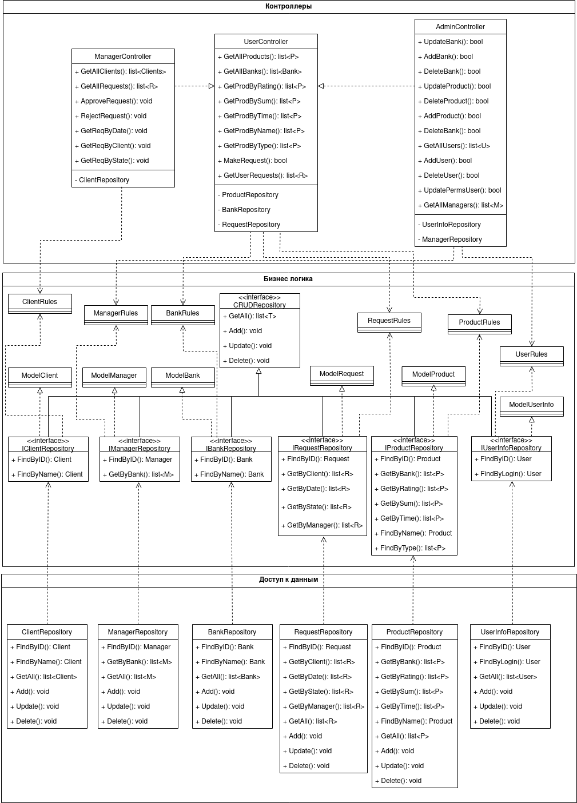
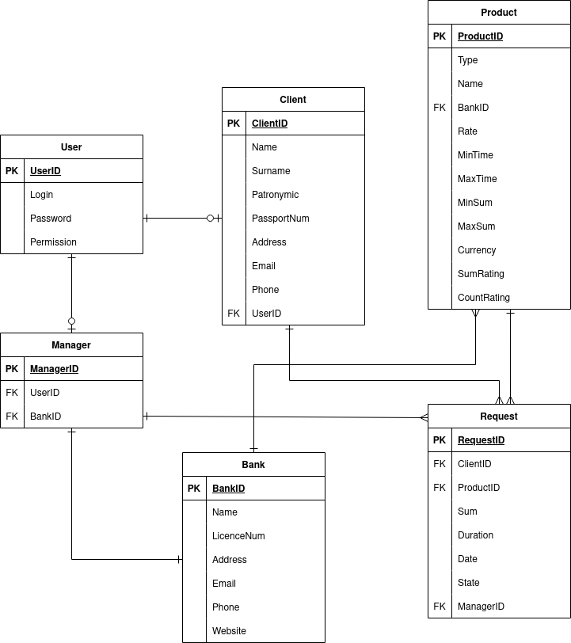
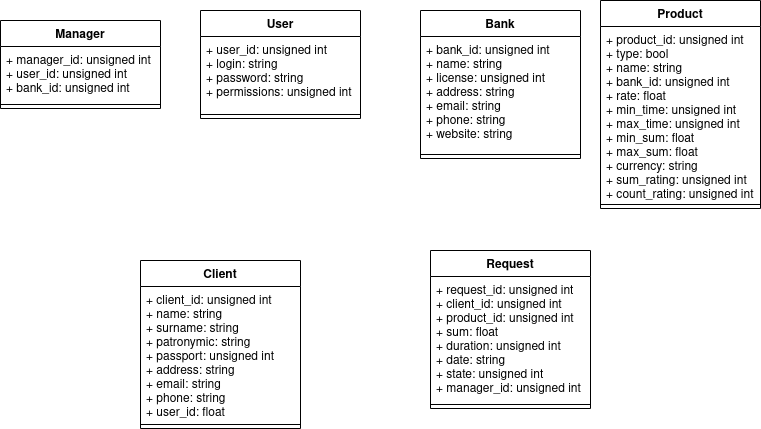

# Лабораторная работа №2

## Описание типа приложения и выбранного технологичекого стека

Тип приложения - Desktop

Технологический стек:
1. ЯП - C++
2. СУБД - PostgreSQL
3. UI - Qt

|  | Oracle | Microsoft SQL Server | PostgreSQL |
| --- | --- |----------------------|------------|
| Бесплатная | - | -                    | +          |
| Безопасность данных | + | +                    | +          |
| Поддержка стандарта SQL | + | +                    | +          |
| Поддержка хранимых процедур и триггеров | + | +                    | +          |
| Кросплатформенность | + | +/-                    | +          |

В качестве языка программирования был выбран C++.
Он является универсальным полноценным объектно-ориентированным языком 
с поддержкой интерфейсов и статической типизации.

## Верхнеуровневое разбиение на компоненты (диаграмма компонентов)
На базовом уровне выделены 3 компонента:
1. компонент доступа к данным;
2. компонент бизнес-логики;
3. компонент реализации UI.

## UML диаграммы классов для двух отдельных компонентов - компонента доступа к данным и компонента с бизнес-логикой

## UML диаграммы «модельных» классов сущностей: сущности базы данных, сущности системы и транспортные сущности

### Сущности базы данных

### Сущности системы

### Транспортные сущности

